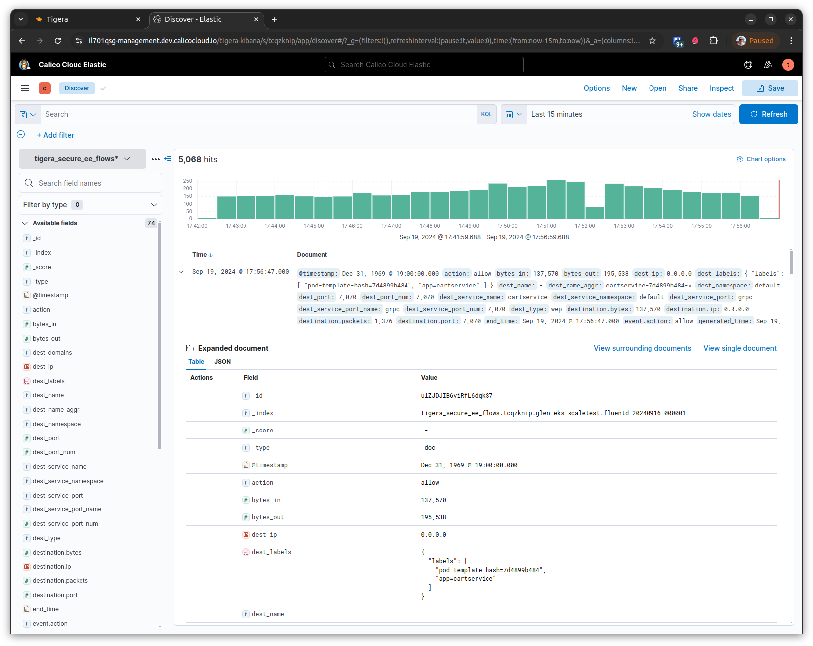

# Fake Log Generator

## Summary
This is a log generator for load testing Calico Cloud.

It generates flow logs by simply loading a file of example flow logs (gathered from a real cluster running the google-microservices-demo), and then grabbing random logs from that (and updating timestamps) to make up a batch of logs, and finally uploading that batch of logs to the voltron/guardian/linseed/ES chain.

To install it in a CC cluster, simply apply the `manifests/cloud-log-generator.yaml file`.  This is a modified fluentd manifest, borrowing fluentd's service account, tokens and secrets.

RATE and BATCH_SIZE are the only env vars you need to edit.  They control the logs generated per second, and the size of the batch of logs uploaded to ES.
The upload process takes about a second, so RATE should not be higher than BATCH_SIZE.  To mimic fluentd, BATCH should be 5 times RATE (fluentd uploads every 5 seconds).

If the whole loop of {generating the logs} + {uploading the logs} takes too long, the container will log that it was `Unable to complete this iteration in time, logs are being rate-limited`.  I find that we can sustain 1000 logs per second with a single pod.  It will use about 50mcpu and 22MB of memory.  If you need a higher rate, scale the deployment up.

Because the logs aren't completely realistic, service graph only shows a partial set of the microservices demo, and the flow-vis view is very broken.  This really is a tool for stressing the log upload chain.

## Local Setup

1. Ensure you have a managed cluster provisioned an connected to a Calico Cloud management cluster before starting this procedure.
2. Change to the `/manifests` directory
3. If needed, open `cloud-log-generator.yaml` and change the `RATE` and `BATCH_SIZE` to a value you are interested in testing. For Multi-tenant clusters, you may need to specify the `TENANT_ID` to send these logs too.
4. Update KUBECONFIG variable to the cluster you want the install the log generator. Then run:
```shell
kubectl apply -f cloud-log-generator.yaml
```
5. This will deploy the flow-log-gen pod. Wait a few minutes for the log generator to start pushing and uploading those logs to ES.
6. Check ES kibana to know if flow log records got stored in ES and are showing up. You should notice that counts will increase per interval if the log generator is working. These fake flow logs are timestamped with `Dec 31, 1969` and based on services from the microservices-demo, see image below.




## Local Test

Run `local_test.sh`. By default, this deploys the log-generator at a rate of 100 logs per second and batch size of 200. It also sets `DIRECT_OUTPUT=true` to directly write to a file for a real fluentd to upload the records.